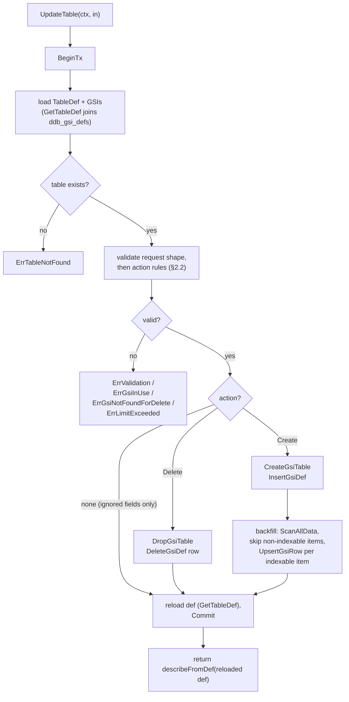

# ddb-sqlite M6a — UpdateTable (GSI add/remove) Design

**Date:** 2026-08-02
**Status:** Approved (brainstorming), revised after design review → pending implementation plan
**Parent spec:** `docs/superpowers/specs/2026-07-31-ddb-sqlite-design.md` (§6.1, §11 M6)
**Scope:** This spec is **M6a** only — the `UpdateTable` operation with Global Secondary Index create and delete. The remaining original-M6 line items (full golden corpus, fuzz pass, edge-case audit) are deferred to a separate **M6b** spec.

## 1. Overview & approach

M6a adds **`UpdateTable`** to the engine (`ddb`) and adapter (`awsdynamodb`), supporting GSI **create** and **delete** as the only behavioral changes. Everything else AWS `UpdateTable` accepts — billing mode, provisioned throughput, SSE, streams, replicas — is **validated minimally then accepted-and-ignored**: no error, no behavioral change. This matches parent spec §6.1 ("throughput/stream changes accepted-and-ignored since provisioning is out of scope").

**GSI add is synchronous.** A single `UpdateTable` transaction creates the GSI catalog row, creates the GSI index table, and **backfills** the index from every existing data row in that same transaction. When the call returns, the index is `ACTIVE` and queryable with all matching existing items. There is no `CREATING` window, no asynchronous backfill, and no status column — the serialized single-writer model makes a transaction-scoped backfill the natural and simplest choice. The engine never simulates backfill scan duration; the index is `ACTIVE` the moment the transaction commits.

**GSI delete is synchronous.** The same transaction drops the GSI index table and removes its catalog row. After the call the GSI is absent from `DescribeTable` and unqueryable.

**One GSI action per call.** AWS documents (SDK `UpdateTable` API docs): *"You can create or delete only one global secondary index per UpdateTable operation"* — and more generally only one operation (throughput modify, GSI create, or GSI delete) at a time. Accordingly, `UpdateTable` accepts **at most one** `GlobalSecondaryIndexUpdates` entry and rejects combining it with any accepted-and-ignored field. This is deliberately restrictive: a mock that accepts what the real service rejects lets user code pass tests and fail against production DynamoDB, while an over-strict mock surfaces immediately at test time. Probes P4/P6 (§8) confirm dynamodb-local's enforcement; if the reference target turns out permissive, the engine stays restrictive and those cases run adapter-only (§8 tie-break principle).

**20-GSI cap.** A `Create` on a table that already has 20 GSIs returns `LimitExceededException`. This matches the current AWS per-table GSI limit (as of 2026). Probe P3 (§8) checks whether dynamodb-local enforces the cap; if it does not, the conformance case runs adapter-only. Note the existing asymmetry: `CreateTable` with more than 20 GSIs is rejected by `analyzeCreateTable` with `ErrValidation` today, while the 21st via `UpdateTable` gets `ErrLimitExceeded` — same quota, different codes per operation. Probe P10 (§8) checks what dynamodb-local returns for create-with-21-GSIs; if it returns `LimitExceededException`, `analyzeCreateTable`'s check moves to `ErrLimitExceeded` so both operations agree.

**Reuse over duplication.** The GSI validators already in `analyzeCreateTable` (`validateGsiKeySchema`, `validateProjection`, `validGsiName`) are factored into reusable helpers shared by `CreateTable` and `UpdateTable`'s create path — the same rules, one code path. `UpdateTable` additionally needs a *merged* attribute-types map (the table's already-declared key attrs plus the input `AttributeDefinitions`); that merge is new logic, specified in §2.2 rule 7.

**No timing probe.** Per project decision, the engine is immediate-`ACTIVE` regardless of table size. There is no probe of backfill timing or of any `CREATING`→`ACTIVE` transition, because the engine never has one. The probes M6a runs (§8) settle error-code and validation-behavior questions for conformance, not timing.

### Relationship to the conformance suite

The conformance suite runs against both the in-process adapter and `dynamodb-local`. `dynamodb-local` *is* asynchronous for GSI add: it returns `IndexStatus=CREATING` immediately and backfills over real time. Therefore conformance cases that query a newly-added GSI never assert "immediately queryable"; they **poll `DescribeTable` until `IndexStatus==ACTIVE`** before querying. On the adapter this poll is a no-op (the index is already `ACTIVE`); on `dynamodb-local` it takes a few seconds. This keeps the assertions honest across both targets with no timing assumption about our engine. GSI delete may have the same asymmetry (a `DELETING` window on dynamodb-local); probe P7 (§8) decides whether delete cases need a matching `waitForGsiGone` poll.

## 2. Operation contract & data flow

### 2.1 Input/output types (`ddb/tables.go`)

```go
// GlobalSecondaryIndexUpdate is one action in an UpdateTable call. Exactly one
// of Create or Delete must be non-nil (enforced by validation rule 4, §2.2).
type GlobalSecondaryIndexUpdate struct {
    Create *GlobalSecondaryIndex // non-nil for a Create action
    Delete *string                // non-nil GSI name for a Delete action
}

type UpdateTableInput struct {
    TableName                   string
    AttributeDefinitions        []AttributeDefinition // attrs referenced by the new GSI
    GlobalSecondaryIndexUpdates []GlobalSecondaryIndexUpdate
    // NonGsiFieldsPresent is true when the caller supplied any
    // accepted-and-ignored field (billing mode, provisioned throughput,
    // streams, SSE, replicas, GSI throughput Update actions, ...). Only the
    // adapter can see those fields; it sets this marker so the engine can
    // distinguish a truly empty update (rejected, rule 2) from a
    // throughput-only update (no-op success), and can reject a GSI action
    // combined with other operations (rule 5). The fields themselves have no
    // representation in core and are dropped.
    NonGsiFieldsPresent bool
}

type UpdateTableOutput struct {
    TableDescription TableDescription
}
```

`GlobalSecondaryIndexDescription` gains one field: `IndexStatus string`, always `"ACTIVE"` in this engine. `Backfilling` is not represented; `ItemCount`/`IndexSizeBytes` handling is unchanged (see §4 for the accurate baseline).

### 2.2 Engine flow (`ddb.UpdateTable`)



**Validation order.** Everything runs on the single transaction held for the whole call (§2.3): `BeginTx`, load the `TableDef` (which joins the GSI defs), validate in one pass — request-shape rules first, then state rules — then mutate, then reload the def and commit. Validation cannot run before the transaction: rule 1 (table exists) and rule 7 (the merged types map) need the loaded def, and catalog reads take a `*sql.Tx`. No write happens before validation completes, so a validation failure has nothing to roll back beyond the load. The returned `TableDescription` is built from the def **reloaded after the catalog mutation** (`GetTableDef` on the same tx), so it reflects the added/removed GSI — returning the pre-update def would omit it. Validation order within the pass:

1. Table exists → else `ErrTableNotFound`. (Precedes every other check.)
2. Truly empty update: no `GlobalSecondaryIndexUpdates` entries AND `NonGsiFieldsPresent` false → `ErrValidation` (DynamoDB rejects a no-change `UpdateTable`). A throughput-only call has the marker set and proceeds as a no-op success — provided it carries no `AttributeDefinitions` (rule 6).
3. More than one `GlobalSecondaryIndexUpdates` entry → `ErrValidation` (AWS: one GSI action per `UpdateTable`).
4. The single entry must set exactly one of `Create`/`Delete` → else `ErrValidation`.
5. A GSI action combined with `NonGsiFieldsPresent` true → `ErrValidation` (AWS: one operation per call).
6. `AttributeDefinitions` present without a `Create` action (a `Delete` action, or an ignored-fields-only call) → `ErrValidation`. Stray defs are rejected, never silently dropped: real DynamoDB validates provided `AttributeDefinitions`, and accepting nonsense defs would let code pass the mock and fail against the service (probe P8).
7. `Create` action, in order:
   - valid GSI name (`validGsiName`),
   - build the **merged types map**: the table's already-declared key attrs (table keys + existing GSI keys, from the loaded `TableDef`) plus the input `AttributeDefinitions`. Duplicate names within the input → `ErrValidation`. An input attr already declared with a **different** type → `ErrValidation`; already declared with the same type → accepted and ignored;
   - valid key schema (`validateGsiKeySchema` against the merged map),
   - valid projection (`validateProjection`),
   - every input `AttributeDefinition` not already declared must be referenced by the new GSI's key schema → else `ErrValidation` (surplus attrs rejected, mirroring `analyzeCreateTable`'s check but scoped to the new GSI),
   - GSI name already in use → `ErrGsiInUse`,
   - table already has 20 GSIs → `ErrLimitExceeded`.
8. `Delete` action: name refers to an existing GSI → else `ErrGsiNotFoundForDelete` (see §3, probe P1). Name *format* is not validated on the delete path as specified — an invalid-format name simply isn't found; probe P12 checks whether dynamodb-local returns `ValidationException` there, in which case a `validGsiName` check is added before the existence lookup.

Rules 3–5 make same-name-within-a-call collisions structurally impossible (there is only ever one action), so no combined-set or duplicate-action validation is needed. (An earlier draft allowed multiple actions per call; AWS rejects that, and allowing it would also have leaked a raw SQLite `PRIMARY KEY (table_id, name)` constraint error on duplicate creates instead of `ErrValidation`.)

**Backfill detail.** For a `Create`, after the GSI table exists, the engine iterates all data rows of the table (`ScanAllData`, §5), decodes each to an `Item`, and applies the **indexability predicate**: an item is indexed iff every key attribute the GSI declares is present AND valid for its declared type — scalar of the matching type, non-empty for S/B. This is exactly what `validateGsiKeys` enforces on the write path, applied as a skip-predicate rather than an error. Items failing it — missing key attrs (ordinary sparsity), wrong-typed or non-scalar values under a key-attr name, empty S/B values — are **not indexed**. This matches real DynamoDB's backfill over items written before the GSI existed, which were never validated against the new key types.

The backfill must **not** reuse `maintainGsiRows`' bare key-computation: that path assumes write-time-validated items, and over pre-GSI items it would abort the whole `UpdateTable` (`keyValue` errors on a non-scalar key value; a wrong scalar type violates the STRICT key column) or wrongly index empty-string keys. The factoring is a shared per-item helper returning `(hashVal, rangeVal, indexable)`; the write path keeps `validateGsiKeys` for AWS-shaped error messages on invalid writes, and both write-time maintenance and backfill consume the helper's key values for indexable items. The refactor must preserve two write-path invariants: `validateGsiKeys` still runs **before** the storage write on every mutating op (`PutItem`, `UpdateItem`, `BatchWriteItem`) so a rejected write stays atomic, and its error message texts are unchanged (engine tests assert them). For a composite GSI the RANGE attr is required for indexability (hash present, range absent → not indexed — the same probe-G20 rule `maintainGsiRows` implements today).

**Key immutability:** `UpdateTable` never alters the table's own key schema or existing GSIs' definitions; it only adds/removes one GSI entry in the catalog and its index table.

### 2.3 Transaction discipline

All catalog changes, GSI table DDL, and the backfill run on the single `*sql.Tx` held for the whole call — the same discipline as `CreateTable`/`PutItem` (parent spec §7). A GSI add that fails partway (e.g. a backfill decode error) rolls the whole transaction back, leaving the table unchanged. No statement is ever issued through the parent `*sql.DB` inside the transaction.

## 3. Error contracts

New sentinels in `ddb/errors.go`:

```go
ErrGsiInUse             = errors.New("ddb: global secondary index already exists")
ErrLimitExceeded        = errors.New("ddb: limit exceeded")
ErrGsiNotFoundForDelete = errors.New("ddb: global secondary index not found")
```

`ErrGsiNotFound` (existing, M3) stays mapped to `ValidationException` — it is the Query/Scan `IndexName` path. `ErrGsiNotFoundForDelete` is deliberately separate so the adapter can route `UpdateTable` delete-of-unknown-GSI to the SDK type dynamodb-local returns for that context. **Probe P1 (§8):** if dynamodb-local returns `ValidationException` (not `ResourceNotFoundException`) for delete-of-unknown-GSI, then `ErrGsiNotFoundForDelete` is dropped and both paths reuse `ErrGsiNotFound` → `ValidationException`. The sentinel is carried now and collapsed if the probe says so.

Adapter `mapError` additions (`awsdynamodb/adapter.go`):

| Engine error | SDK exception |
|---|---|
| `ErrGsiInUse` | `types.ResourceInUseException` *(pending probe P2)* |
| `ErrGsiNotFoundForDelete` | `types.ResourceNotFoundException` *(pending probe P1)* |
| `ErrLimitExceeded` | `types.LimitExceededException` |

`LimitExceededException` **is** a generated SDK type (unlike `ValidationException`, which is why `ErrValidation`/`ErrGsiNotFound` use `smithy.GenericAPIError`). Mapping to `GenericAPIError{Code: "LimitExceededException"}` would break `errors.As(err, &types.LimitExceededException{})` parity with the reference target; the typed exception is required.

`ErrValidation` and `ErrTableNotFound` already map correctly.

## 4. DescribeTable changes

`GlobalSecondaryIndexDescription` gains `IndexStatus string`, always `"ACTIVE"` in this engine. The adapter's `toSDKTableDescription` sets `IndexStatus: types.IndexStatusActive` on each GSI description. `describeFromDef` populates it for every GSI (existing and newly added) uniformly. No `Backfilling` status is represented.

**`TableStatus`.** The adapter's `toSDKTableDescription` also sets `TableStatus: types.TableStatusActive` on every description — a small baseline fix bundled with M6a, since today it leaves the field empty, which real DynamoDB never does for an existing table. `UpdateTableOutput` therefore reports `ACTIVE` too; real AWS reports `UPDATING` during backfill, but the mock is synchronous, so `ACTIVE` is the honest steady-state. Conformance asserts `TableStatus` only in quiescent cases — never immediately after an `UpdateTable` on the dynamodb-local target.

**`ItemCount`/`IndexSizeBytes`.** The adapter currently reports both as **0** for every GSI (pre-existing behavior — reported as zero, *not* omitted). Real DynamoDB eventually-populates them; the mock keeps reporting 0. M6a leaves this unchanged and conformance cases never assert them. Reporting real values remains out of scope (§9).

`AttributeDefinitions` in `DescribeTable` already includes GSI key attrs: the existing `describeFromDef` dedups them by walking `def.GSIs`. After a `Create` adds a new GSI with new key attrs, the next `DescribeTable` includes those new `AttributeDefinition` entries — no change needed to that logic.

## 5. Storage layer changes (`internal/storage`)

Two small additions:

1. **`DeleteGsiDef(tx *sql.Tx, tableID int64, name string) error`** (`catalog.go`). The existing `DeleteGsiDefs` drops *all* GSIs for a table (used by `DeleteTable`); M6a needs a single-GSI delete for `UpdateTable` remove. One statement:
   ```sql
   DELETE FROM ddb_gsi_defs WHERE table_id = ? AND name = ?
   ```

2. **`ScanAllData(tx *sql.Tx, table string) (next func() (id int64, data []byte, err error), err error)`** (`tables.go`). A row iterator over
   ```sql
   SELECT id, data FROM <data_table> ORDER BY id
   ```
   returning a `next` closure (the streaming-row pattern). The `ddb` layer decodes items lazily and calls `UpsertGsiRow` per indexable row, so the backfill does not buffer the whole table into memory. The `next` closure returns `io.EOF` when the rows are exhausted; any other non-nil error aborts the backfill (and the enclosing transaction rolls back). This is a deliberate deviation from the existing `Query`/`Scan` slice-returning convention, chosen so a large backfill need not hold every row in memory.

   **Interleave safety.** The design knowingly deviates from `ExpireExpired`, which buffers ids and closes its rows before writing ("cannot issue DELETE while iterating on the same tx") — but `ExpireExpired` DELETEs from the *same* table it scans, while the backfill INSERTs into the new GSI table while iterating the *data* table. That different-table interleave is **pinned by test, not assumed**: §7.2 adds a storage test that iterates a `SELECT` on one table while `INSERT`ing each visited row into a second table on the same tx, asserting every row is visited and the writes commit — a driver regression (or a modernc.org/sqlite upgrade that changes same-tx interleave behavior) fails loudly instead of corrupting a backfill.

`DropGsiTable`, `CreateGsiTable`, `UpsertGsiRow`, `InsertGsiDef`, `GetGsiDef`, `GetGsiDefs` already exist — no changes to them.

**No schema migration; no meta update.** GSI definitions persist solely as `ddb_gsi_defs` rows; `GetTableDef` re-joins them via `GetGsiDefs`, so inserting or deleting the catalog row inside the `UpdateTable` transaction is the *entire* persistence story — a reopen sees the new GSI set with no additional write. The `meta` blob (creationTime) is untouched; there is no GSI snapshot in `meta` to update. (An earlier draft of this spec called for a "persist `def.GSIs` snapshot in meta" step; that mechanism does not exist — `CreateTable` persists GSIs as catalog rows, not via `meta`.)

## 6. Adapter layer (`awsdynamodb`)

`Adapter.UpdateTable` translates SDK `dynamodb.UpdateTableInput` → `ddb.UpdateTableInput`:

- `TableName`: nil or empty → `ValidationException` via a **new** adapter guard (no such guard exists today — every op currently passes `aws.ToString(params.TableName)` straight through, so an empty name surfaces as `ResourceNotFoundException`. The guard is added for `UpdateTable` only; the same gap on other operations is pre-existing and out of scope, §9).
- Structural check: more than one SDK `GlobalSecondaryIndexUpdates` entry → `ValidationException` at the adapter (mirrors engine rule 3; this count includes `Update` actions, which never reach the engine — so two throughput-`Update` actions, or a `Create`/`Delete` plus an `Update`, are rejected here).
- Structural check: a GSI `Update` action combined with any ignored field present → `ValidationException` at the adapter. The `Update` action produces no core entry, so engine rule 5 cannot see this combination; the adapter must reject it itself (AWS: one operation per call; probe P4). Multiple ignored fields with no GSI entry at all are *not* split — they count as one accepted-and-ignored operation (`BillingMode=PROVISIONED` + `ProvisionedThroughput` is the normal throughput modify) and pass through as a no-op (§9).
- `AttributeDefinitions` → core `[]AttributeDefinition`. The engine rejects them when the call carries no `Create` action (rule 6).
- Each SDK `types.GlobalSecondaryIndexUpdate` → core union:
  - SDK `Create` action (carries `IndexName`/`KeySchema`/`Projection`) → core `GlobalSecondaryIndex`. Its `ProvisionedThroughput` is dropped — accepted-and-ignored.
  - SDK `Delete` action → core `*string`. A nil `IndexName` produces an entry with both fields nil, which engine rule 4 rejects with `ErrValidation`.
  - SDK `Update` action (GSI throughput change) → **accepted-and-ignored when it is the call's only operation**: produces no core entry and sets `NonGsiFieldsPresent`. Combined with any other operation it is rejected by the structural checks above. Consistent with table-level throughput being accepted-and-ignored (parent spec §6.1); unlike `Expected` (`rejectLegacy`), nothing behavioral is being claimed, so silent acceptance of the lone case is honest.
- Ignored fields → `NonGsiFieldsPresent`; values are dropped. The presence checklist is **exactly** the non-GSI-update fields of `dynamodb.UpdateTableInput` (SDK v1.62.3): `BillingMode`, `TableClass`, `MultiRegionConsistency`, `GlobalTableSettingsReplicationMode` (enums — present iff non-empty), `ProvisionedThroughput`, `StreamSpecification`, `SSESpecification`, `DeletionProtectionEnabled`, `OnDemandThroughput`, `WarmThroughput` (pointers — present iff non-nil, so an explicit `DeletionProtectionEnabled: aws.Bool(false)` counts), and `ReplicaUpdates`, `GlobalTableWitnessUpdates` (slices — present iff non-empty). A missed field silently degrades engine rules 2 and 5 (an ignored-field-only call misreads as truly empty; a GSI action combined with that field goes unrejected), so the checklist must be re-verified against the SDK's field list on every SDK upgrade.
- A call with no GSI entries and no ignored fields present → engine rule 2 → `ValidationException`.
- `mapError` on the result; the returned `TableDescription` is translated to SDK `types.TableDescription` per §4 (`IndexStatus: IndexStatusActive` and `TableStatus: TableStatusActive` on every description; `ItemCount`/`IndexSizeBytes` unchanged at 0; `Backfilling` omitted).

## 7. Testing strategy

### 7.1 Engine unit tests (`ddb/tables_test.go`, `ddb/gsi_test.go`)

Table-driven, mirroring existing `tables_test.go` patterns:

- Create GSI on an empty table → `DescribeTable` lists it (`IndexStatus=ACTIVE`), `Query` works (returns no items).
- Create GSI on a table with existing items → backfill populates the index; `Query` returns the matching existing items; sparse items missing the GSI key attribute are absent.
- **Backfill skips non-indexable items:** seed pre-GSI items with (a) a wrong-typed value, (b) a non-scalar value, (c) an empty-string value under the new GSI's key-attr name → `UpdateTable` succeeds and those items are absent from the index (the regression test for the §2.2 indexability predicate — without it, (a) and (b) abort the call and (c) is wrongly indexed).
- Composite-GSI backfill: items with the GSI hash attr but no range attr are not indexed (probe-G20 rule).
- Create GSI whose key attribute overlaps a table key (e.g. GSI partition = table sort key) → allowed, indexed correctly.
- Delete GSI → `DescribeTable` omits it; `Query` with that `IndexName` → `ErrGsiNotFound`.
- Create existing GSI name → `ErrGsiInUse`.
- Delete unknown GSI → `ErrGsiNotFoundForDelete` (or `ErrValidation` per probe P1).
- 21st GSI → `ErrLimitExceeded`.
- Two `GlobalSecondaryIndexUpdates` entries → `ErrValidation`.
- An entry with neither or both of `Create`/`Delete` set → `ErrValidation`.
- Empty updates with `NonGsiFieldsPresent=false` → `ErrValidation`; with `=true` → no-op success, `DescribeTable` unchanged.
- A GSI action with `NonGsiFieldsPresent=true` → `ErrValidation`.
- `AttributeDefinitions`: missing declaration for a new GSI key attr → `ErrValidation`; conflicting-type redeclaration of an already-declared attr → `ErrValidation`; unused input attr → `ErrValidation`; same-type redeclaration of an already-declared attr → accepted.
- Stray `AttributeDefinitions`: present with a `Delete` action → `ErrValidation`; present on an ignored-fields-only call (`NonGsiFieldsPresent=true`, no GSI entries) → `ErrValidation` (rule 6).
- Unknown table → `ErrTableNotFound` (and it precedes all other validation).
- After a failed add (e.g. backfill decode error injected via a bad stored blob), table state unchanged (transaction rollback; the GSI catalog row and index table are absent afterward).

### 7.2 Storage unit tests (`internal/storage/`)

- `DeleteGsiDef` removes one GSI catalog row, leaves the others intact.
- `ScanAllData` iterates all rows in `id` order and signals exhaustion via `io.EOF`.
- `ScanAllData` interleave: while iterating, INSERT each visited row's id into a second table on the same tx; assert every row is visited and the writes commit (pins §5's interleave-safety pattern against the driver).

### 7.3 Conformance suite (`awsdynamodb/conformance_test.go`)

New `TestConfUpdateTable*` cases, parameterized over both targets via the existing `runConformance` harness:

- **GSI add + backfill:** seed items, `UpdateTable` create GSI, **poll `DescribeTable` until `IndexStatus==ACTIVE`** via a new `waitForGsiActive(t, api, table, gsi)` helper (10 s bounded poll that **fails the test** on timeout — the adapter is `ACTIVE` immediately, and a healthy dynamodb-local activates a small-table GSI in well under 10 s, so a timeout is a real failure, not flake), then `Query` the new GSI and assert the backfilled items match. This is the only query-after-add case and it gates on the poll, never on a timing assumption.
- **GSI delete:** create a GSI (via `CreateTable` or `UpdateTable`), delete it via `UpdateTable`, assert `DescribeTable` omits it and `Query` with that `IndexName` fails. If probe P7 finds a `DELETING` window on dynamodb-local, the describe assertion polls via a matching `waitForGsiGone` helper instead of asserting immediately.
- **Error cases:** add-existing → the SDK type fixed by probe P2; delete-unknown → the type fixed by P1; 21st-GSI → `types.LimitExceededException` via `errors.As` (adapter-only if P3 shows dynamodb-local doesn't enforce the cap, §8); two GSI actions and empty-updates → `ValidationException` (multi-action adapter-only if P4 shows dynamodb-local permissive); GSI action + `BillingMode` → `ValidationException` (adapter-only if P6 shows permissive); throughput-`Update` combinations — two `Update` actions, `Update` + `Create`, `Update` + `BillingMode` — → `ValidationException` (adapter-only if P4 shows permissive); stray `AttributeDefinitions` with a `Delete` action or no GSI action → `ValidationException` (adapter-only if P8 shows permissive); unknown table → `ResourceNotFoundException`. All via `errors.As`.
- **Accepted-and-ignored fields:** `UpdateTable` with `BillingMode`/`ProvisionedThroughput` set and no GSI updates → no error, `DescribeTable` reflects no behavioral change.

`waitForGsiActive(t, api, table, gsi)` is added to the conformance harness and used by every add-then-query case. It loops `DescribeTable` with a 10 s bounded timeout and returns once the named GSI's `IndexStatus == ACTIVE`; on timeout it calls `t.Fatalf` — never `t.Skip`, so a regression that leaves the adapter reporting a non-`ACTIVE` status fails loudly instead of passing as a skip. `waitForGsiGone` (if P7 requires it) follows the same shape — 10 s poll, `t.Fatalf` on timeout — polling until the named GSI is absent from the description.

Cases that can only run against the adapter (P3/P4/P6 permissive outcomes) are written as adapter-only tests with a comment citing this spec section and the tie-break principle — **not** added to a divergence file: the retired `conformance_divergence_test.go` pattern tracked adapter bugs to fix, whereas these are deliberate, permanent divergences from reference-target permissiveness.

### 7.4 Fuzz

No new fuzz targets for M6a. `UpdateTable` validation is string/struct validation, not expression parsing; the existing expression fuzz targets are unaffected.

## 8. Probes (scoped; error codes and validation behavior only)

Small throwaway probes against `dynamodb-local`, run once during implementation — **not** timing probes. Each result is recorded in this spec (§3/§6) and the mapping or test target chosen accordingly. This mirrors the M5b precedent of minimal targeted probes to pin conformance details; probes are throwaway, not committed as permanent tests.

| # | Question (against dynamodb-local) | Default (pre-probe) | Settles |
|---|---|---|---|
| P1 | `UpdateTable` Delete naming a GSI that doesn't exist: `ResourceNotFoundException` or `ValidationException`? | `ResourceNotFoundException` | keep vs drop `ErrGsiNotFoundForDelete` (§3) |
| P2 | `UpdateTable` Create naming an existing GSI: `ResourceInUseException` or `ValidationException`? | `ResourceInUseException` | `ErrGsiInUse` mapping (§3) |
| P3 | Is the 20-GSI cap enforced? | enforced | if permissive: the 21st-GSI case runs adapter-only (§7.3) |
| P4 | Are two operations in one call rejected — Create+Create, Create+Delete, and throughput-`Update` combinations (Update+Update, Create+Update, Update+BillingMode)? (AWS-documented limit: one operation per call.) | rejected | if permissive: multi-action/multi-operation cases run adapter-only; engine and adapter stay restrictive |
| P5 | Is an `UpdateTable` carrying no changes at all rejected with `ValidationException`? | yes | engine rule 2 |
| P6 | Is a GSI action combined with `BillingMode` in one call rejected? | yes | engine rule 5; if permissive: adapter-only, engine stays restrictive |
| P7 | Is a deleted GSI absent from `DescribeTable` immediately, or is there a `DELETING` window? | immediate | whether §7.3 needs `waitForGsiGone` |
| P8 | `AttributeDefinitions` edges: unused input attr rejected? same-type redeclaration of an existing attr accepted? conflicting-type redeclaration rejected? defs present without a `Create` action (with `Delete`, or ignored-fields-only) rejected? | reject / accept / reject / reject | exact engine rules (§2.2 rules 6–7) |
| P9 | Empty `TableName`: `ValidationException`? | yes | the new adapter guard (§6) |
| P10 | `CreateTable` with 21 GSIs: `LimitExceededException` or `ValidationException`? | `ValidationException` (current `analyzeCreateTable` behavior) | whether the CreateTable-side cap check moves to `ErrLimitExceeded` so both operations agree (§1) |
| P11 | `UpdateTable` Create whose key attr is already declared (table key or existing GSI key) but is *not* repeated in the call's `AttributeDefinitions`: accepted? | accepted (rule 7 merged map) | whether the merged map keeps the already-declared allowance or every new-GSI key attr must be declared in-call; if dynamodb-local rejects, the engine rejects (tie-break) |
| P12 | `UpdateTable` Delete naming a syntactically invalid GSI name (e.g. one char): `ValidationException` or `ResourceNotFoundException`? | `ResourceNotFoundException` (existence-only lookup) | whether rule 8 gains a `validGsiName` format check before the existence lookup (§2.2) |

**Tie-break principle.** Where dynamodb-local is more permissive than documented AWS behavior, the engine follows documented AWS (restrictive). A mock that accepts what the real service rejects lets code pass tests and fail in production; an over-strict mock surfaces immediately at test time. Restrictive-only behaviors are tested as adapter-only conformance cases (they cannot run against the reference target) and recorded here as deliberate divergences from dynamodb-local.

### Probe results (executed 2026-08-02)

Ran `TestProbeM6a` (throwaway `awsdynamodb/probe_m6a_test.go`, since deleted) against the live `dynamodb-local` 3.3.1 container via `DDBSQLITE_CONF_TARGET=dynamodb-local DDBSQLITE_CONF_LOCAL_ENDPOINT=http://localhost:45901`. Observed outcomes vs the §8 defaults:

- P1 delete-unknown: `ResourceNotFoundException` (default confirmed) → keep `ErrGsiNotFoundForDelete` → `types.ResourceNotFoundException`.
- P2 create-existing: `ResourceInUseException` (default confirmed) → keep `ErrGsiInUse` → `types.ResourceInUseException`.
- P5 empty: `ValidationException` "Nothing to update" (default confirmed) → engine rule 2 stands.
- P6 GSI-create + BillingMode: `ValidationException` (default confirmed — rejected) → engine rule 5 stands; `TestAdapterUpdateTableGsiPlusBillingMode` stays adapter-only.
- P4 two GSI deletes in one call: `LimitExceededException` "Only 1 online index can be created or deleted simultaneously per table" → the restrictive default (one GSI action per call, rejected) is **confirmed**, so the engine stays restrictive and `TestAdapterUpdateTableTwoActions` stays adapter-only. Note the code divergence: dynamodb-local rejects with `LimitExceededException` while the engine reports `ValidationException`; because the calls do not agree on the error code, the conformance case is not upgraded to dual-target and the engine mapping is unchanged.
- P12 delete-of-invalid-format name (one char): `ResourceNotFoundException` (default confirmed) → no `validGsiName` format check added to the delete path; rule 8 existence-only lookup stands.

**No code adjustments were required** — every probed default was confirmed, so the engine, adapter mapping, and conformance targeting are unchanged by this task.

## 9. Out of scope (M6a)

Deferred to M6b or later, and **not** covered by this spec:

- Full conformance golden-corpus gap-fill and edge-case audit (null vs missing attributes, type-mismatched comparisons, sparse GSIs, trailing empty pages, `LastEvaluatedKey` resume at partition end).
- Fuzz pass beyond the existing expression targets.
- `ItemCount`/`IndexSizeBytes` reporting in `DescribeTable` (the adapter reports 0 today; unchanged).
- Any asynchronous `CREATING`/`Backfilling`/`DELETING` status simulation, and any `UPDATING` table status.
- Modeling `BillingMode`, provisioned throughput, SSE, streams, or replicas behaviorally.
- **Lumping of ignored fields.** Multiple ignored fields in one call with no GSI entry (e.g. `BillingMode` + `SSESpecification`) count as a single accepted-and-ignored operation and pass as a no-op; real AWS may reject some of those combinations as multiple operations. GSI throughput `Update` actions are **not** lumped: each counts as an operation, so multiple `Update` actions or an `Update` combined with any other operation are rejected with `ValidationException` (§6 structural checks, probe P4).
- **Error precedence among validation rules** (e.g. an existing GSI name combined with an invalid key schema — which error surfaces). The engine's rule order (§2.2) is fixed but unprobed; real AWS may order the checks differently.
- Empty-table-name validation on operations other than `UpdateTable` (pre-existing adapter gap; §6 adds the guard for `UpdateTable` only).
- A GSI named identically to its table (no collision check exists in `CreateTable`; carried over unchanged).
- ProjectionExpression (parent spec §8 out of scope for v1).
- `UpdateTable` on a table in the `CREATING`/`DELETING` state (the engine has no such table states).
